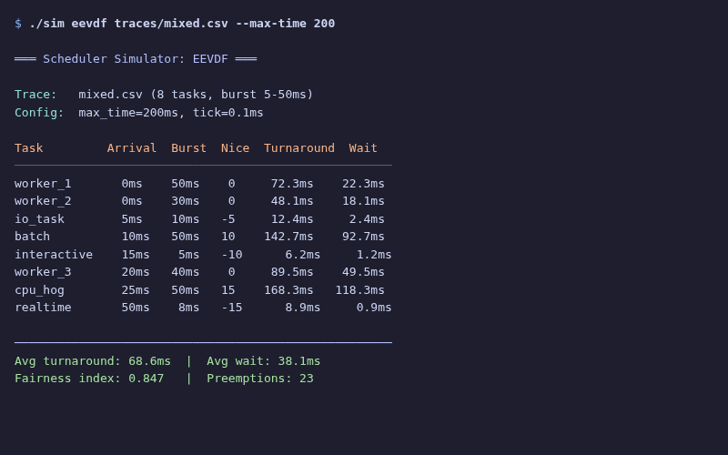

<div align="center">

# Sched Compare

**CFS vs EEVDF Linux scheduler simulator**

[](LICENSE)
[]()
[]()

</div>

A tick-based simulator that compares the Linux CFS (Completely Fair Scheduler) and EEVDF (Earliest Eligible Virtual Deadline First) scheduling algorithms. Reads task traces from CSV, runs both schedulers with configurable tick granularity, and emits a CSV stream of scheduling events (arrival, start, preempt, finish) for analysis. Includes Python scripts for Gantt charts and wait-time CDF plots.

## ■ Features

- ❖ **CFS implementation** — virtual runtime-based fair scheduling with nice levels
- ❖ **EEVDF implementation** — eligible virtual deadline first scheduling with latency-nice support
- ❖ **CSV trace input** — define tasks with name, arrival time, burst, nice, and latency-nice values
- ❖ **Bundled scenarios** — five ready traces: `bursty`, `fairness`, `latency_nice`, `mixed`, `nice_weights`
- ❖ **Configurable simulation** — adjustable max time, tick granularity, and output file
- ❖ **Gantt chart plots** — visualize scheduling timelines with `plot_gantt.py`
- ❖ **Wait-time CDF** — cumulative distribution comparison with `plot_wait_cdf.py`

## ■ Stack

| Component | Technology |
|-----------|------------|
| Simulator | C++17 |
| Plotting | Python, matplotlib, pandas, numpy |
| Build | Make |

## ■ Usage

```bash
# Build the simulator
cd sim && make

# Run a simulation (algo is cfs or eevdf; bundled traces live in traces/)
./sim/sim cfs traces/mixed.csv --max-time 200 --out results/cfs_mixed.csv
./sim/sim eevdf traces/mixed.csv --max-time 200 --out results/eevdf_mixed.csv

# Plot results (scripts read result CSVs via flags, with sensible defaults)
python3 plots/plot_gantt.py --cfs results/cfs_mixed.csv --eevdf results/eevdf_mixed.csv
python3 plots/plot_wait_cdf.py --results-dir results --traces bursty latency_nice
```

## ■ Repository Structure

```
sim/        C++17 simulator (cfs, eevdf, trace loader, tick runner, Makefile)
traces/     Input task traces in CSV
results/    Precomputed per-trace CSV output for cfs and eevdf
plots/      Python plotting scripts (plot_gantt, plot_wait_cdf, shared style)
```

## ■ Screenshots



## ■ License

MIT © [pluttan](https://github.com/pluttan)
